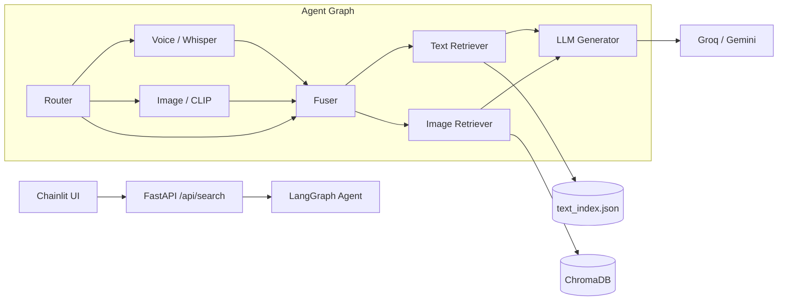

# SmartShop

**Multimodal AI shopping assistant with store-scoped RAG over a live Shopify catalog.**

SmartShop helps customers discover products using **text**, **voice**, or **image** queries. Answers are grounded in your store catalog only — the assistant does not invent products or prices outside retrieved context.

**Links:** [Live Demo](https://huggingface.co/spaces/soumitkundu/smartshop) · [Progress Report](Progress-Report.md) · [Deployment Guide](deployment/README_deploy.md)

---

## Features

- **Store-scoped RAG** — retrieval limited to your Shopify product catalog
- **Multimodal input** — text, voice (Whisper), and image (CLIP) in seven combination modes
- **LangGraph agent** — conditional routing through router → voice → image → fuser → retriever → generator
- **Dual retrieval** — TF-IDF text index + ChromaDB image vectors with RRF rank fusion
- **Conversation memory** — bounded multi-turn sessions for follow-up questions
- **Chainlit UI** — chat interface with rich product cards and Shopify product links
- **Inventory-aware results** — optional filtering of out-of-stock products
- **Observability** — LangSmith tracing for per-node debugging

---

## Architecture



**Data flow:** Kaggle CSV → `products.json` → Shopify sync → text/image indexes → multimodal search → grounded LLM response.

---

## Tech Stack

| Layer | Technologies |
|-------|----------------|
| API | FastAPI, Uvicorn |
| Agent | LangGraph, LangChain Core, LangSmith |
| Retrieval | TF-IDF text index, ChromaDB, CLIP `ViT-B/32` |
| Speech | OpenAI Whisper (local) |
| LLM | Groq (primary), Google Gemini (fallback) |
| Frontend | Chainlit |
| Commerce | Shopify Admin REST API |
| Deployment | Docker, Hugging Face Spaces |

---

## Prerequisites

- **Python 3.11**
- **ffmpeg** (for Whisper audio decoding)
- **API keys:** Groq and/or Google Gemini (free tiers supported)
- **Shopify dev store** + custom app token (for catalog sync)
- **Optional:** LangSmith API key for tracing

---

## Quick Start

### 1. Clone and install

```powershell
git clone <your-repo-url>
cd SmartShop
py -3.11 -m venv .venv
.\.venv\Scripts\Activate.ps1
py -m pip install -r requirements.txt
```

### 2. Configure environment

```powershell
copy example.env .env
```

Fill in at minimum:

- `GROQ_API_KEY` or `GOOGLE_API_KEY`
- `SHOPIFY_STORE_DOMAIN`
- `SHOPIFY_ADMIN_API_ACCESS_TOKEN`

See `example.env` for all options.

### 3. Build the catalog and indexes

```powershell
py -m scripts.format_kaggle --limit 200
py scripts/embed_products.py --input data/products.json --out data/text_index.json
py scripts/embed_product_images.py --input data/products.json
```

Optional — sync products to Shopify:

```powershell
py -m scripts.sync_shopify --limit 200
```

### 4. Run locally

**Terminal 1 — backend**

```powershell
uvicorn backend.main:app --reload --host 127.0.0.1 --port 8781
```

**Terminal 2 — Chainlit UI**

```powershell
chainlit run frontend/app.py -w --port 8080
```

Open the Chainlit URL from the terminal (default `http://localhost:8080`).

> **Windows port note:** If port `8000` is reserved, use `8781` for the backend and set `BACKEND_SEARCH_URL=http://127.0.0.1:8781/api/search` in `.env`.

---

## API Reference

| Method | Endpoint | Description |
|--------|----------|-------------|
| `GET` | `/api/health` | Liveness and readiness checks |
| `POST` | `/api/search` | Multimodal product search (multipart form) |
| `DELETE` | `/api/session/{session_id}` | Clear conversation memory |

### `POST /api/search`

**Form fields**

| Field | Required | Description |
|-------|----------|-------------|
| `session_id` | Yes | Stable id for multi-turn memory |
| `text` | No* | Text query |
| `audio_file` | No* | Voice recording or upload |
| `image_file` | No* | Product photo (JPEG, PNG, WebP) |

\*At least one of `text`, `audio_file`, or `image_file` is required.

**Example response (abbreviated)**

```json
{
  "session_id": "user-123",
  "modality": "text",
  "rejected": false,
  "answer": "...",
  "products": [{ "title": "...", "price": 1379.0, "inventory_quantity": 10 }],
  "node_trace": ["router", "fuser", "retriever", "generator"],
  "memory_turns": 1
}
```

---

## Supported Input Modes

| Mode | Graph path |
|------|------------|
| Text | `router → fuser → retriever → generator` |
| Voice | `router → voice → fuser → retriever → generator` |
| Image | `router → image → fuser → retriever → generator` |
| Text + voice | `router → voice → fuser → retriever → generator` |
| Text + image | `router → image → fuser → retriever → generator` |
| Voice + image | `router → voice → image → fuser → retriever → generator` |
| Text + voice + image | `router → voice → image → fuser → retriever → generator` |

---

## Testing

```powershell
py scripts/test_text_rag.py
py scripts/test_langgraph.py
py scripts/test_voice.py
py scripts/test_image.py
py scripts/test_fusion_memory.py
py evaluation/ragas_eval.py
```

Phase-by-phase setup notes and validation details: [Progress-Report.md](Progress-Report.md).

---

## Deployment

SmartShop ships with a root `Dockerfile` and `deployment/start.sh` for a single-container setup (FastAPI + Chainlit).

**Recommended:** connect your GitHub repository to Hugging Face Spaces so each push rebuilds the demo automatically.

| Step | Action |
|------|--------|
| 1 | Create Space `soumitkundu/smartshop` (SDK: **Docker**, Public) |
| 2 | Space **Settings → Repository → Connect to GitHub** |
| 3 | Select this repo and branch (`main`) |
| 4 | Add secrets: `GROQ_API_KEY`, `SHOPIFY_STORE_DOMAIN`, etc. |
| 5 | Push to GitHub — HF rebuilds on each commit |

Full guide: [deployment/README_deploy.md](deployment/README_deploy.md)

**Local Docker smoke test**

```powershell
docker build -t smartshop .
docker run --rm -p 7860:7860 --env-file .env smartshop
```

---

## Project Structure

```
SmartShop/
├── backend/           # FastAPI app, LangGraph agent, RAG, processors
├── frontend/          # Chainlit chat UI
├── scripts/           # Data sync, embedding, and test scripts
├── evaluation/        # Evaluation queries and metrics runner
├── deployment/        # Docker startup script and deploy docs
├── data/              # Kaggle source data and generated catalog artifacts
├── Dockerfile         # Hugging Face Spaces / Docker image
├── example.env        # Environment template
└── Progress-Report.md # Phase-by-phase build log
```

---

## Configuration Highlights

| Variable | Purpose |
|----------|---------|
| `LLM_PROVIDER` | `groq` or `gemini` |
| `TOP_K_RESULTS` | Number of products retrieved per query |
| `EXCLUDE_OUT_OF_STOCK` | Filter zero-stock products from results |
| `MEMORY_WINDOW_TURNS` | Bounded conversation history per session |
| `WHISPER_MODEL` | Whisper size (`base` recommended) |
| `BACKEND_SEARCH_URL` | Chainlit → FastAPI endpoint |

Copy `example.env` to `.env` and adjust as needed. Never commit `.env`.

---

## Documentation

- [Progress-Report.md](Progress-Report.md) — detailed phase-by-phase implementation log
- [deployment/README_deploy.md](deployment/README_deploy.md) — Hugging Face Spaces via GitHub
- [example.env](example.env) — full environment reference

---

## License

This project is provided for portfolio and educational use. Add your preferred license file before public distribution.
